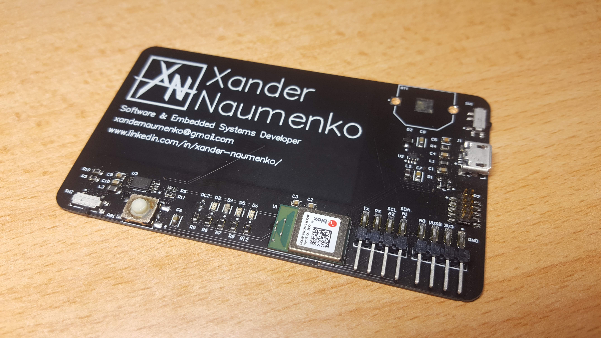
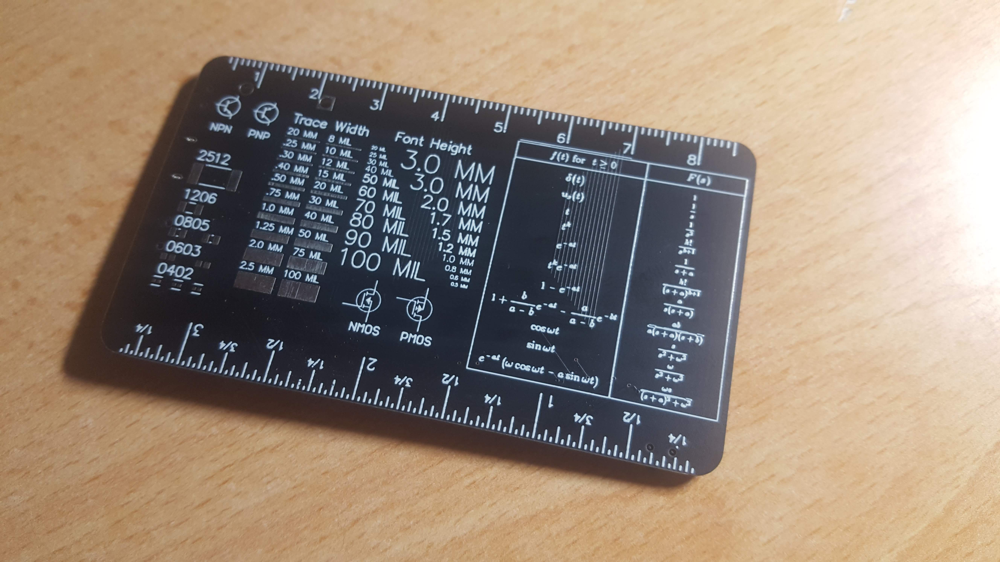
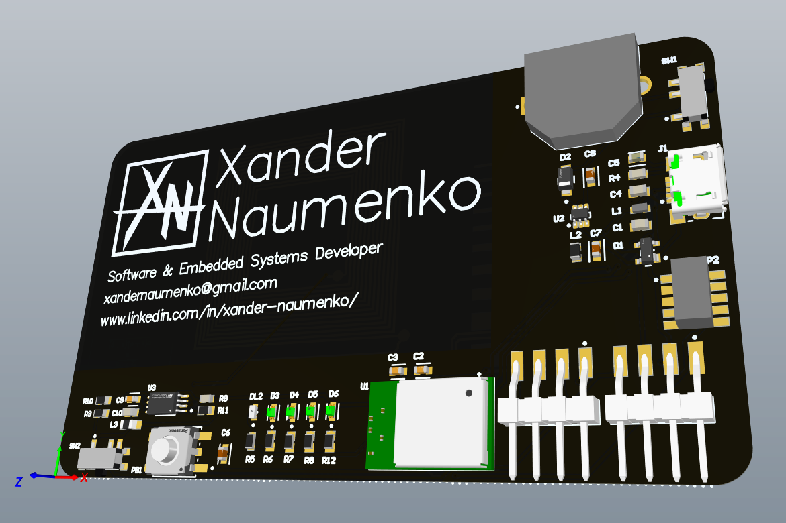
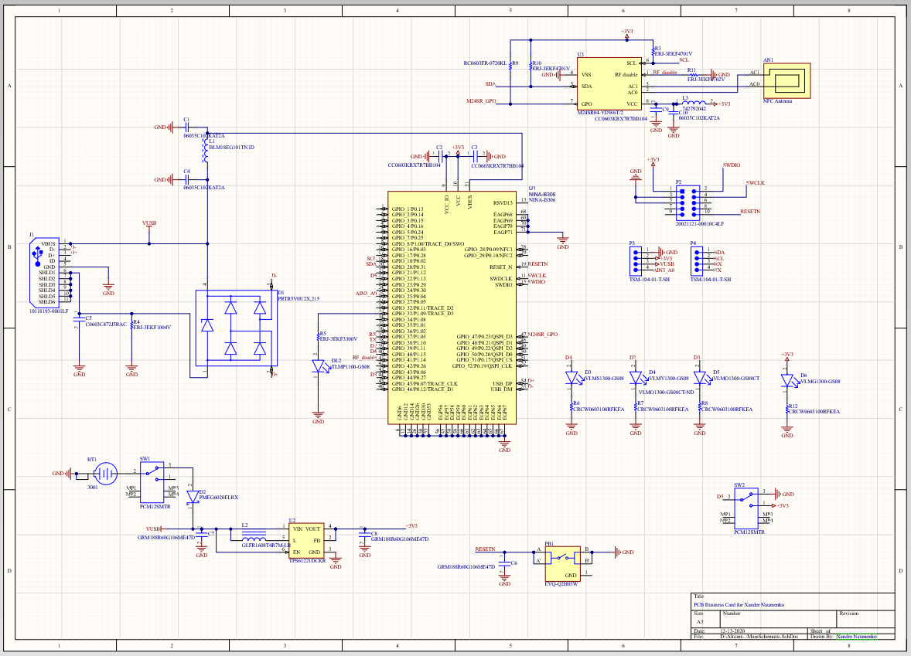
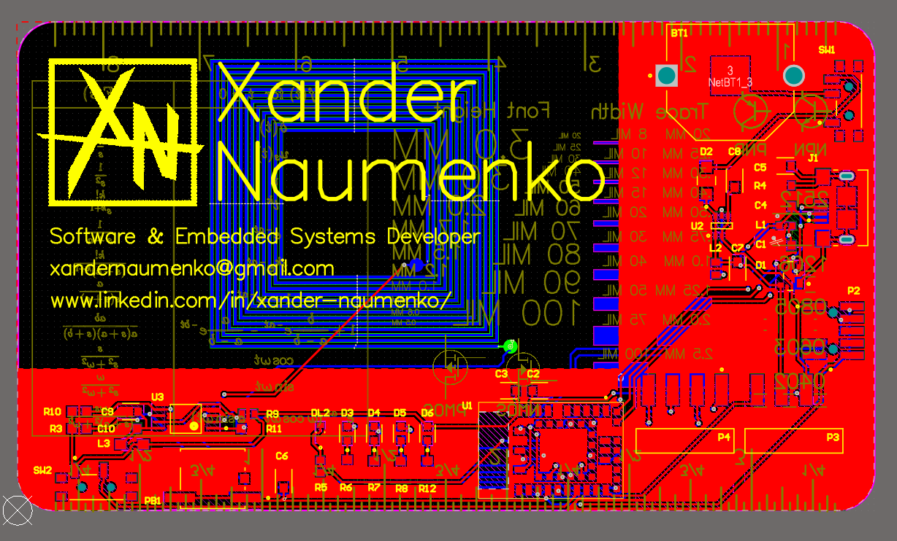

<h1 align="center">
   
  PCB Business Card
</h1>

This is my custom PCB business card. At the end of 2020 I wanted a project to learn more about the principles of PCB design, so I decided to make a fully custom PCB that functions both as a microcontroller and as a business card. It has the following functionality: 

- Fully programmable microcontroller compatible with and Arduino bootloader (although SWD flashing is required first)
- Bluetooth communication
- NFC capabilities with just one chip being soldered on
- UART, SPI and analog/digital outputs through standard pin headers
- Easily powered through micro USB
- 5 LEDs to indicate power/digitally toggle
- 1 power switch, one input switch and an input pushbutton

The final product looks like this: 

I used Altium to design the board. A lot of it was a learning experience so some aspects of the design probably don't follow best practices, but I'm very happy with how the design turned out. This is the schematic and x-ray view of the board: 

After it was designed, I ordered all the necessary components and physically built the board using a reflow oven. The first attempt version was shorted due to a misaligned chip (in hindsight I definitely should have avoided hand placing a BGA MCU), but the the second attempt at soldering worked and the MCU can successfully be programmed. 

## Issues

If anyone wants to make a similar PCB or even use this design while just changing the silkscreen, here are some problems with what's currently on Github. 

1. The Battery is way underspecced. I misinterpreted a datasheet and as such the battery can't provide enough current for the MCU. To fix this would probably required moving some layout around to fit a bigger battery. Right now that just means that the PCB can only be powered through USB which works fine. 

2. The font on the back for the table of Laplace transforms was printed weird. That might just be an issue on JLCPCB's side but as it is there are some random lines slightly out of place and the equations aren't super readable. This is just aesthetic though and doesn't affect anything electrically. 
